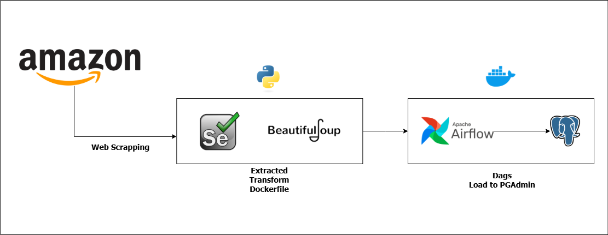

# AMAZON WEB SCRAPPING APPLICATION WITH AIRFLOW


This project involves extracting product data from Amazon using Selenium for dynamic web page interaction and BeautifulSoup for parsing structured information. The scraped data undergoes an ETL process orchestrated by Apache Airflow, running within Docker containers for seamless deployment. The workflow consists of multiple Airflow DAGs: an extraction task to scrape product details, a transformation task to clean and standardize data, and a loading task to store the processed data in PostgreSQL.

## Project Goal

- Implement Selenium Webdriver and BeautifulSoup to scrape raw data from Amazon Websales
- Perform full ETL using Python to create cleaned dataset file from raw scrapped data
- Use Airflow as orcestra to create Dags and PostgreSQL PgAdmin as database using Docker

## Tech Stack

- Python
- Airflow
- PostgreSQL / PgAdmin
- SQLAlchemy
- Selenium
- Docker
- BeautifulSoup4

## Pipeline Process

For Full Dags Documentation, Check : [`Dags`](dags\etl_dags.py)

`Setting Up Project Virtual Envirovment`

```Shell
python -m venv .venv
.venv/Scripts/activate
```

`Create Requirements.txt`

```text
apache-airflow
apache-airflow-providers-postgres
pandas
bs4
requests
selenium
psycopg2-binary
sqlalchemy
```

`Create Dockerfile`

```python
FROM apache/airflow:2.10.5

COPY requirements.txt /requirements.txt

RUN pip install --upgrade pip
RUN pip install --no-cache-dir -r /requirements.txt
```

`Inisiate Airflow with Extends`

```bash
curl -LfO 'https://airflow.apache.org/docs/apache-airflow/2.10.5/docker-compose.yaml'

mkdir -p ./dags ./logs ./plugins ./config
echo -e "AIRFLOW_UID=$(id -u)" > .env

AIRFLOW_UID=50000

docker compose up airflow-init
```

`Create ETL program within DAGS file`

`Run`

```bash
Docker Compose up --build
```

## Dags Flow and Database

`Dags` `Extact Data -> Wait Raw Data -> Cleaned Data -> Wait Clean Data -> Load to PostgreSQL`


`PostgreSQL Database`


